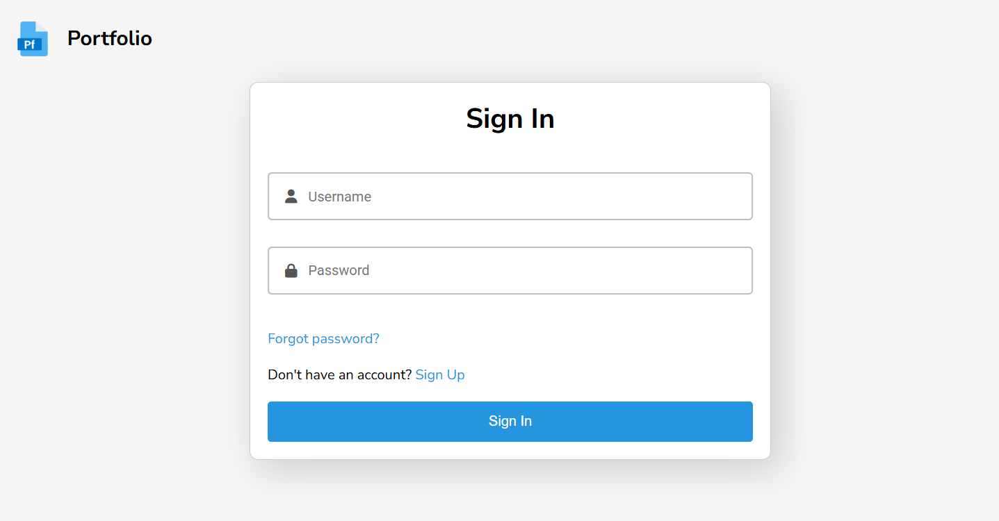
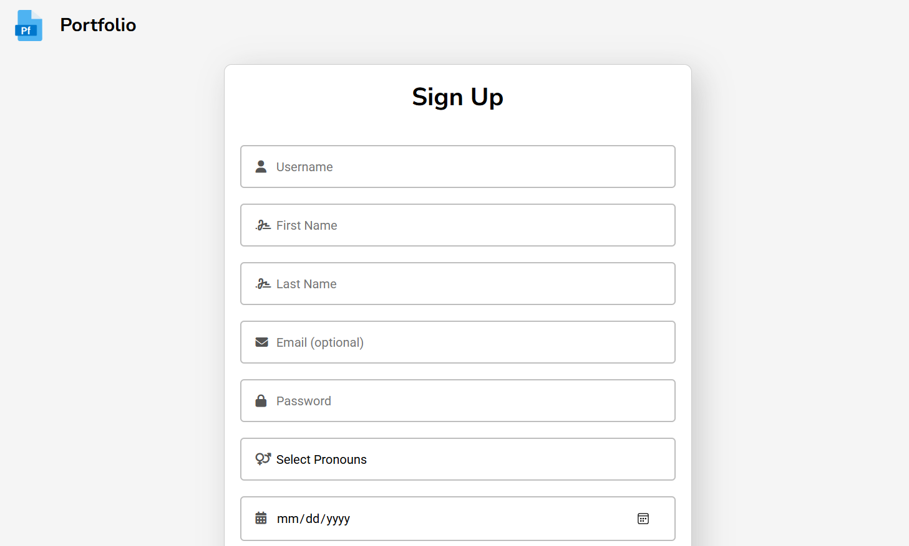
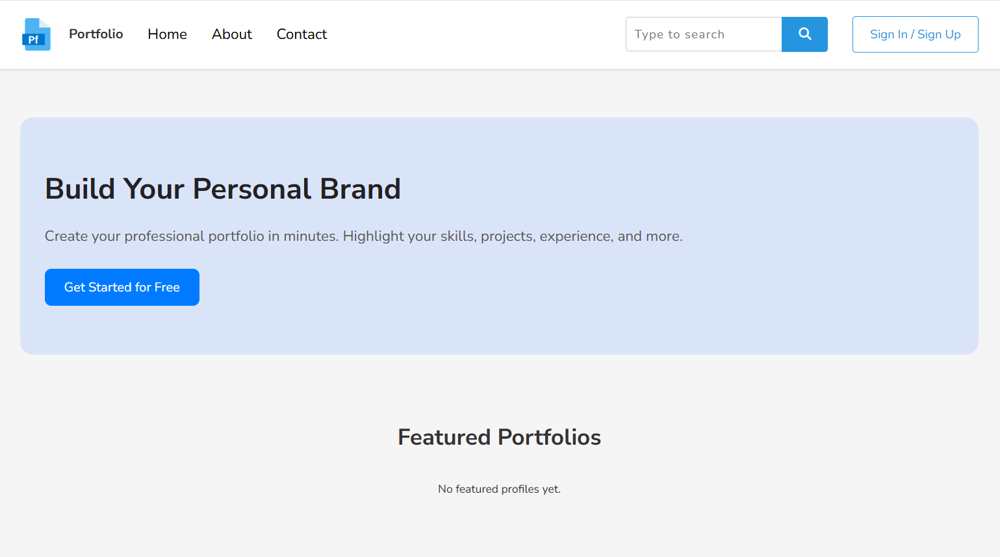
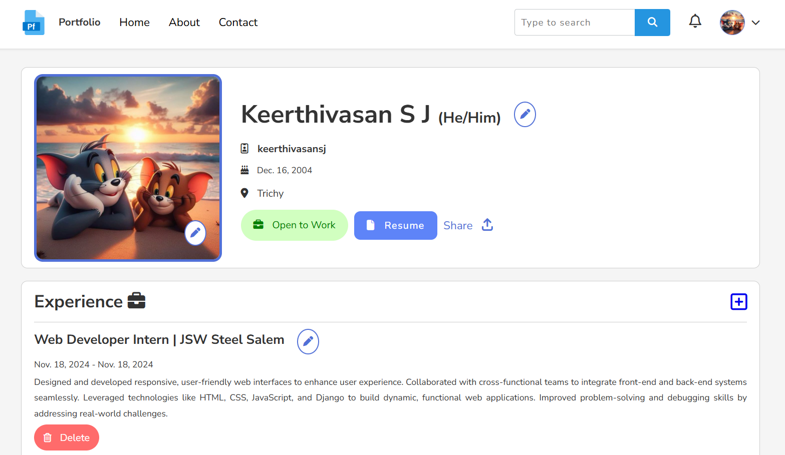

# 💼 Personal Portfolio Maker

> A dynamic and customizable portfolio generator built with Django. Designed to help individuals create, manage, and showcase their personal and professional achievements with ease.

>      
---

## 📌 Table of Contents

- [Overview](#overview)
- [Screenshots](#screenshots)
- [Features](#features)
- [Tech Stack](#-tech-stack)
- [Installation](#installation)
- [Contact](#-contact)

---

## Overview

The **Personal Portfolio Maker** is a web application where users can:
- Create an account
- Fill in personal information like skills, education, certifications, and more
- Upload profile images
- Generate a modern portfolio website dynamically
- Download, update, or share the portfolio

It is ideal for students, developers, and job-seekers looking to showcase their credentials professionally.

---

## Screenshots

### 🔹 Sign In Page

> The login screen allows existing users to access their dashboard securely using their credentials.

---

### 🔹 Sign Up Page

> New users can register by filling out the sign-up form, which includes basic authentication fields.

---

### 🔹 Landing Page

> This is the user-friendly home page of the portfolio site, giving quick access to profile editing and live preview.

---

### 🔹 User Profile

> The profile editing section lets users input or update their personal details, skills, education, projects, certifications, and more.

---

## Features

- ✅ User registration and login
- 🖊️ Editable personal profile sections:
  - About Me
  - Skills
  - Education
  - Experience
  - Certifications
  - Projects
  - Languages
- 📸 Upload and update profile picture
- 📄 Live preview of the portfolio
- 🧠 Smart form validation and section toggling
- 📦 Export-ready and printable version of the portfolio
- 🎨 Responsive design for mobile and desktop

---

## 🧰 Tech Stack

| Layer       | Technologies Used                    |
|-------------|--------------------------------------|
| Frontend    | HTML, CSS, JavaScript     |
| Backend     | Django (Python)                      |
| Database    | SQLite (default)  |

---


## Installation

To run this project locally:

```bash
# 1. Clone the repository
git clone https://github.com/Keerthivasan-s-j/personal-portfolio-maker.git

# 2. Move into the project directory
cd personal-portfolio-maker

# 3. Create a virtual environment (recommended)
python -m venv venv
source venv/bin/activate  # For Windows: venv\Scripts\activate

# 4. Install dependencies
pip install -r requirements.txt

# 5. Run migrations
python manage.py migrate

# 6. Start the server
python manage.py runserver

```

## 📬 Contact

Feel free to connect with me for collaboration, feedback, or questions!

[](https://github.com/Keerthivasan-s-j)
[](https://www.linkedin.com/in/keerthivasansj)

